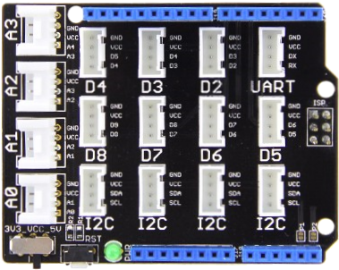
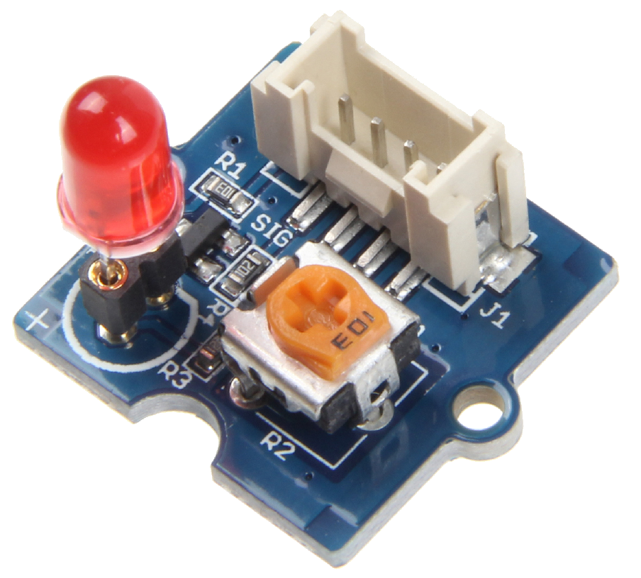
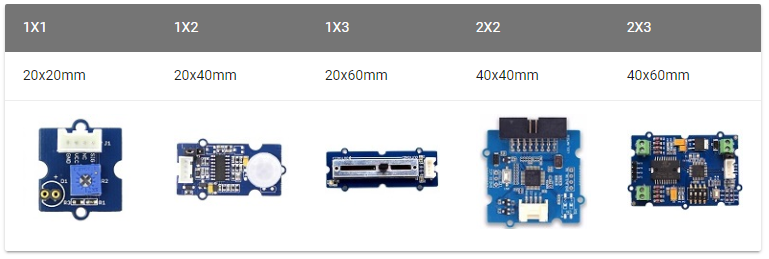
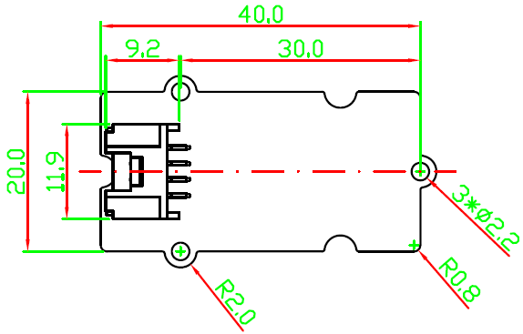
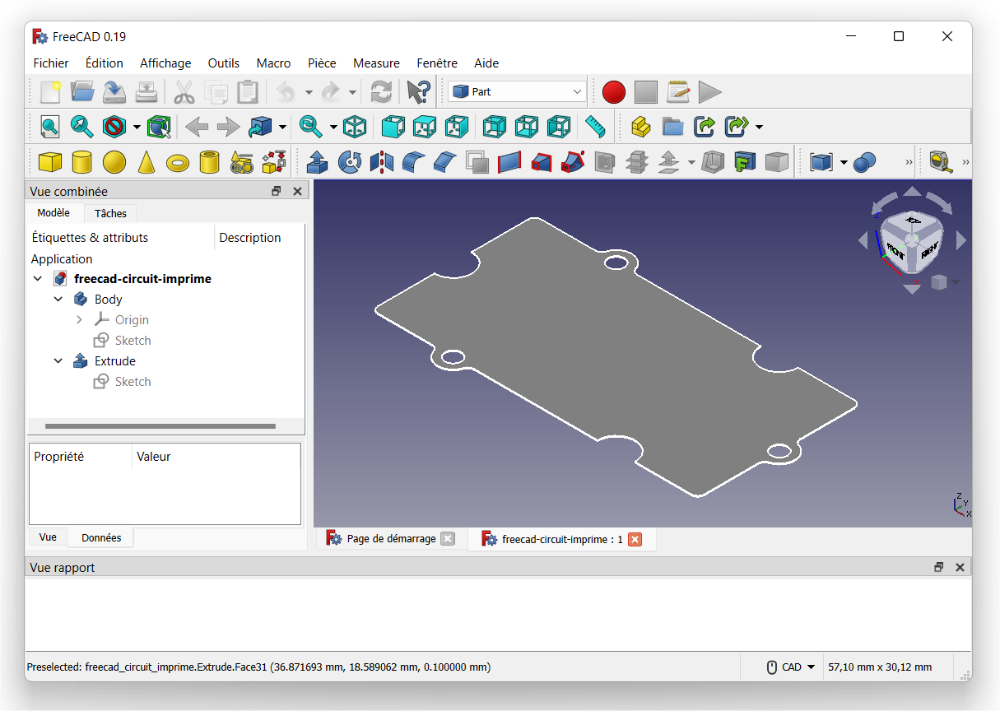
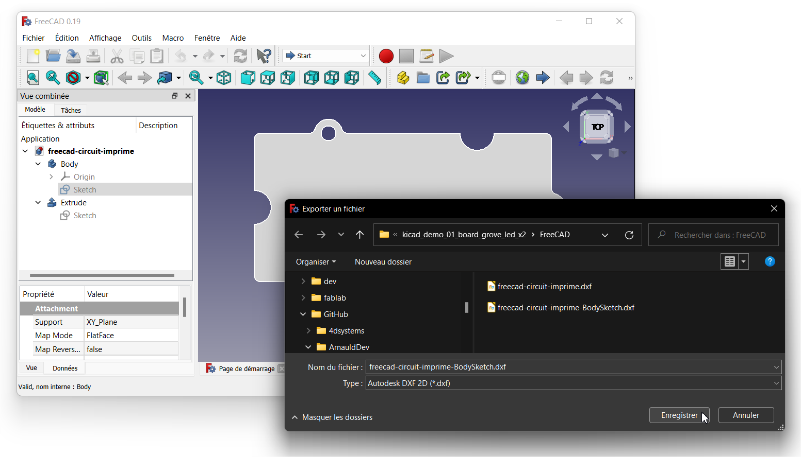
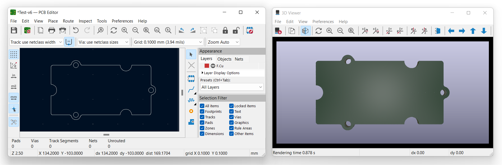

# Réseau des Electroniciens

<https://www.electroniciens.cnrs.fr/>

- [Bienvenue sur les pages wiki du groupe CAO](https://wiki.electroniciens.cnrs.fr/index.php/Le_groupe_CAO) > [KiCad](https://wiki.electroniciens.cnrs.fr/index.php/CAO_:_KICAD)

# Demo 01 : LED Control Mode - Grove Interface

Réaliser une carte électronique compatible avec les connectiques GROVE, exemple d'une Shield au format UNO :



## Exemple de cartes identiques

- [Grove - LED Socket Kit](http://wiki.seeedstudio.com/Grove-LED_Socket_Kit/)
- [Grove - Red LED](http://wiki.seeedstudio.com/Grove-Red_LED/)



mais pas de modules avec deux LED : <http://wiki.seeedstudio.com/Display/>

Donc à partir des conventions des modules Grove, nous allons réaliser notre propre carte
voir "[les différentes tailles standardisées des modules Grove](http://wiki.seeedstudio.com/Grove_System/#size-of-grove)"


Comment dans KiCad importer un DXF pour réaliser le contour layer du PCB
voir "[6.1.2. Utilisation d’un dessin DXF pour le contour du circuit](http://docs.kicad-pcb.org/stable/fr/pcbnew.html#_creation_d_8217_un_circuit)"

Réalisation du contour d'une carte au format DXF sur le modèle d'un module Grove 1x2 avec un logiciel de CAO FreeCAD/Inventor/SolidWorks

- Taille du module : [20x40 mm](img/freecad-esquisse-pcb-20x40mm.png)
- Source "[Grove Mechnical Drawing](https://github.com/SeeedDocument/GroveSystem/tree/master/res)" : [Grove-20x40mm.pdf](https://github.com/SeeedDocument/GroveSystem/blob/master/res/Grove-40x40-SMD-horizontal/Grove-%E8%B4%B4%E7%89%87%E5%BA%A7%E5%AD%90-%E8%BA%BA.pdf)



[Épaisseur de circuit imprimé & Matière](https://www.wedirekt.fr/fr/web/technologie/pcb-technologie/sp-cification/dimensions-et-mati-re.fs-1235901.html)

---

## Application KiCad (64-bit)

Version: (6.0.5), release build

```txt
  Libraries:
    wxWidgets 3.1.5
    libcurl/7.82.0-DEV Schannel zlib/1.2.12

  Platform: Windows 10 (build 22000), 64-bit edition, 64 bit, Little endian, wxMSW

  Build Info:
    Date: May  3 2022 00:36:16
    wxWidgets: 3.1.5 (wchar_t,wx containers)
    Boost: 1.79.0
    OCC: 7.6.0
    Curl: 7.82.0-DEV
    ngspice: 36
    Compiler: Visual C++ 1929 without C++ ABI

  Build settings:
    KICAD_USE_OCC=ON
    KICAD_SPICE=ON
```

## Nouveau projet

Créer un nouveau projet "demo_carte_led" dans "C:\cao\kicad\projects", pas besoin de créer un répertoire pour le projet, un dossier sera créer automatiquement.

### Ajouter des composants

- Device:LED
  - 2x value LED
- Device:R
  - 2x value 220
- Connector_Generic:Conn_01x04
  - 1x value GROVE

# Les empreintes des composants d'usage courant

- footprint LED_THT:LED_D5.0mm
- footprint Resistor_THT:R_Axial_DIN0207_L6.3mm_D2.5mm_P10.16mm_Horizontal
- footprint Connector_JST:JST_PH_B4B-PH-K_1x04_P2.00mm_Vertical

[7. Association Composants - Empreintes avec CvPcb](http://docs.kicad-pcb.org/stable/fr/cvpcb.html#_association_composants_empreintes_avec_cvpcb)

# Fichier d'association des symboles aux empreintes

L'extension du nom des fichiers d'association est en *.equ

voir ["Association Automatique"](https://docs.kicad.org/6.0/fr/cvpcb/cvpcb.html#association_automatique_ou_manuelle)

Exemple : ..\demo_carte_led\association_fp.equ

---

## Application FreeCAD

<https://www.freecadweb.org/?lang=fr>

```txt
OS: Windows 10 Version 2009
Word size of OS: 64-bit
Word size of FreeCAD: 64-bit
Version: 0.19.24267 +148 (Git)
Build type: Release
Branch: Branch_0.19.4
Hash: 476ecf091941bead59b14e44afa6064d5a66afa3
Python version: 3.8.6+
Qt version: 5.15.2
Coin version: 4.0.1
OCC version: 7.5.3
Locale: French/France (fr_FR)
```



Depuis le menu **Fichier > Exporter**; sélectionner le **Sketch** de **Body** pour obtenir un contour de carte correcte, puis choisir le format **Autodesk DXF 2D (*.dxf)** :



Et voici le test de l'import dans KiCad :



### FreeCAD Documentation

Wiki : [Aide en ligne - table des matières](https://wiki.freecadweb.org/Online_Help_Toc/fr)

* [Atelier PCB](https://wiki.freecadweb.org/PCB_Workbench/fr)
* [Atelier KicadStepUp](https://wiki.freecadweb.org/KicadStepUp_Workbench/fr)
